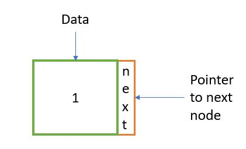
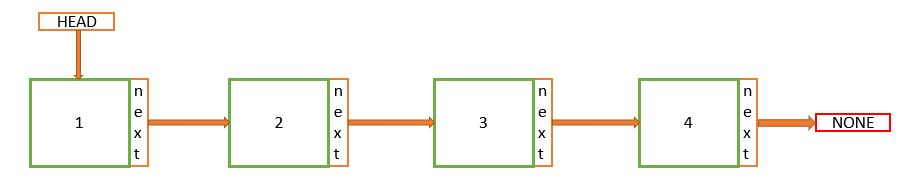
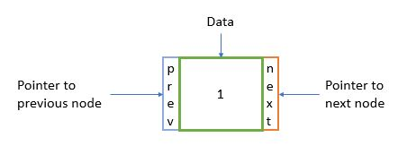
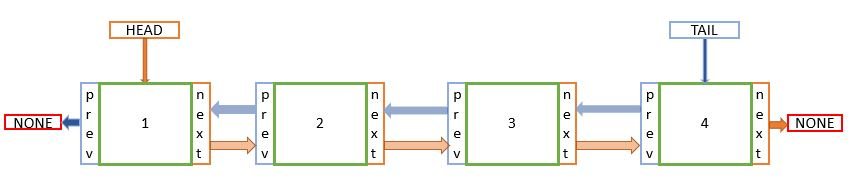
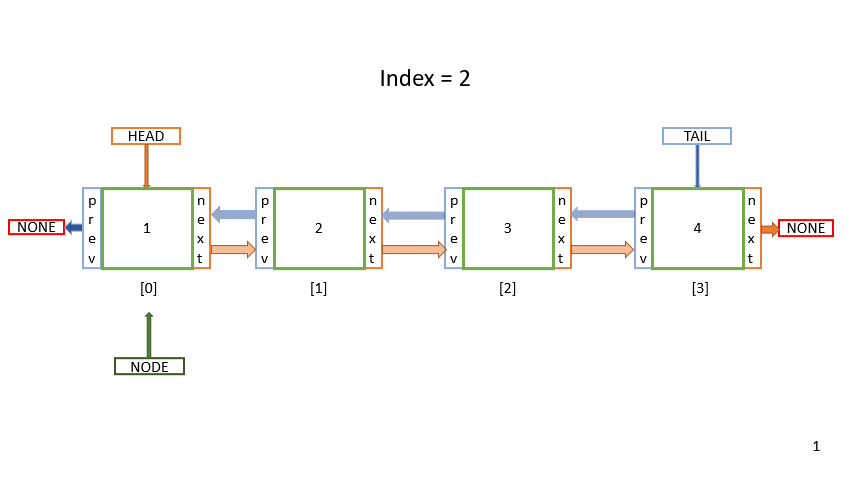
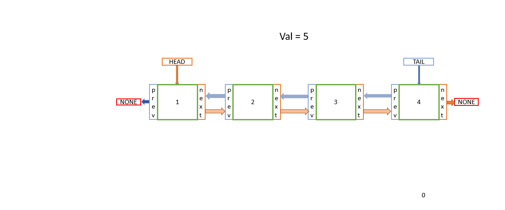
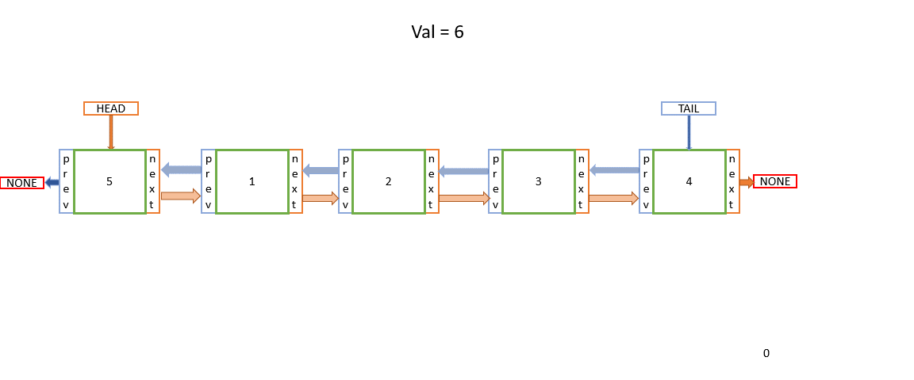
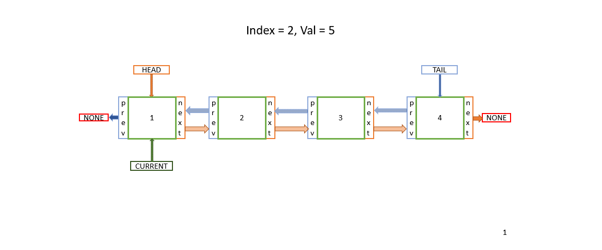
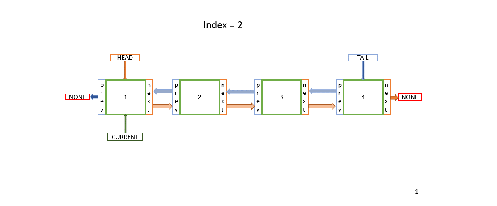

# Linked-List

## What is a linked list?
A linked list is a collection of data elements that are connected with pointers. There are two types of linked-lists: `single linked` and `double linked`. 

The main difference between a linked list and an Array is how they are store in memory. Arrays use contiguous memory w

### Single liked list
In the single linked list, the the elements (also called `nodes`) are connected in a linear way. A single node could be represented like the image bellow:



The first element (called `head`) point to the next node, and that next node point to the next and so on as represented in the image bellow:



The last node in the list will have the next pinter pointing to null

### Double liked list
In the double linked list the nodes have two pointers and a data value, the additional pointer in the double list points to the prev pointer. 
Here is a visual representation of a single node:



In addition, a double linked list have two additional pointers, one pointing to the first node (Called the `Head`) an another pointing to the last node (Called the `Tail`). Here a visual representation of a complete double linked list:



## Designing our own linked list in python
There is not in build in class for a linked list on python however we can design a class to create a list which behaved like a liked list, in this tutorial we will work with a double linked list since this is the most complete example

We will create the next methods in our class to interact with our linked list (we will follow the [leetcode](https://leetcode.com/explore/learn/card/linked-list/209/singly-linked-list/1290/) sample):

* `get(index)`: Will get the value of the index<sup>th</sup> node in the linked list. If the index is invalid, return -1.
* `addAtHead(val)`: Will add a node of value `val` before the first element of the linked list. After the insertion, the new node will be the first node of the linked list.
* `addAtHead(val)` Will add a node of value `val` before the first element of the linked list. After the insertion, the new node will be the first node of the linked list.
* `addAtTail(val)` Will append a node of value `val` as the last element of the linked list.
* `addAtIndex(index, val)` Add a node of value `val` before the index<sup>th</sup> node in the linked list. If index equals the length of the linked list, the node will be appended to the end of the linked list. If index is greater than the length, the node will *not be inserted*.


This is the template for linked list class (again, this is provided by [leetcode](https://leetcode.com/explore/learn/card/linked-list/209/singly-linked-list/1290/))

```python
class MyLinkedList(object):

    def __init__(self):
        

    def get(self, index):
        """
        :type index: int
        :rtype: int
        """
        

    def addAtHead(self, val):
        """
        :type val: int
        :rtype: None
        """
        

    def addAtTail(self, val):
        """
        :type val: int
        :rtype: None
        """
        

    def addAtIndex(self, index, val):
        """
        :type index: int
        :type val: int
        :rtype: None
        """
        

    def deleteAtIndex(self, index):
        """
        :type index: int
        :rtype: None
        """
```

First thing to do here, is to add a subclass for our nodes, here we write a constructor to create our default node:

```python
class Node:
    def __init__(self,data):
        self.val = data
        self.prev = None
        self.next = None
```
We got the data and store into `val`, by default the previous and next pointers will be `None`

The constructor will have set our tail and head pointers to `None`, in addition we will set a `size` as helper for other functions

```python
def __init__(self):
    self.head = None
    self.tail = None
    self.size = 0
```

For the `get` method we should begin by the head and iterate through the list `index` times, and then return the value of the current node. The `get` function would look like:

```python
def get(self, index):
    if self.head is None: #If the list is empty we don't have something to return
        return -1
    
    node = self.head #Begin with the head
    for i in range(index):
        node = node.next #Iterate through the list
        if node is None: #Invalid index
            return -1

    return node.val #Return the current value
```
If this code is not perfectly clear, take a look to this image:



__Performance:__ *O(n)* in the worst case when the value of `index` ins the same as `self.size`

For the `addToHead` function we need to follow this steps:
1. Create a new node
2. Set the next pointer from the new node to the current head
3. Set the prev pointer from the head to the new node
4. Assign the current head to the new pointer

Graphically the step by step would look like:


In the code we have an special case, this is when adding the first node to our linked list. In this specific case we set both the tail and head to the same node. The add function would look like:
```python
def addAtHead(self, val):        
    node = MyLinkedList.Node(val) #1
    
    if self.size == 0: # Special case: empty linked list
        self.tail = node
        self.head = node
    else: 
        node.next = self.head #2
        self.head.prev = node #3
        self.head = node #4
    
    self.size = self.size + 1 #if we have a new node the size increases
```
__Performance:__ *O(4)* one for each step, which can be simplified to *O(1)*

The `addToTail` method will behave similar to `addToHead`. These are the steps:
1. Create a new node
2. Set the prev pointer from the new node to the current tail
3. Set the next pointer from the tail to the new node
4. Assign the current tail to the new pointer

Here is the illustration:


The function would look like:
```python
def addAtTail(self, val):
    node = MyLinkedList.Node(val) #1
    
    if self.size == 0: # Special case: empty linked list
        self.head = node
        self.tail = node
    else:
        node.prev = self.tail #2
        self.tail.next = node #3
        self.tail = node #4

    self.size = self.size + 1 #size increases when we add a new node to the list
```
__Performance:__ *O(4)* one for each step, which can be simplified to *O(1)*

To add a new node in an specific index we should (it will be inserted *before* the existing node in the given index):

1. Iterate through the list `index` times to find the desired index
2. Create the new node
3. Set the next pointer from the new node to the current node
4. Set the previous pointer from the new node the previous node of the current node
5. The node before the current node should point now to the new node
6. The previous pointer from the current node should point to the new node

Here is a visualization:


Additionally, we have some special cases to handle:

* What would happen if `index` is 0?
* What would happen if `index` is greater than the current size
* Our instruction says that we should add the node to the end of the linked list if `index` is equal to the size of the list. (for this purpose we created the size data attribute in the constructor before)

The function would look like:

```python
def addAtIndex(self, index, val):
    if index == self.size: #Special case index = size: add to tail instead
        self.addAtTail(val)
        return
    
    if index == 0: #Special case index = 0: add to head instead
        self.addAtHead(val)
        return
    
    if index > self.size: #Special case index out of bounds: don't do anything
        return
    
    node = self.head #1
    for i in range(index):
        node = node.next
        
    newNode = MyLinkedList.Node(val) #2
    
    newNode.next = node #3
    newNode.prev = node.prev #4
    
    node.prev.next = newNode #5
    node.prev = newNode #6
    
    self.size = self.size + 1 #increment our size helper
```
__Performance:__ The worst case is when `index` value is `self.size - 1`, in which case the performance would be *O(n + 5)* where n represent the value on `index`, which simplified would be *O(n)*

The process for the `deleteAtIndex` would consist in just modifying pointers. In python we don't need to delete the node from memory tanks to [garbage collection](https://stackify.com/python-garbage-collection/) which is a kind of a system that would delete the a node if nothing is pointing to it.

We just need to follow these steps:
1. Find the the node to be deleted
2. Get the previous node, and modify its next pointer to point to the current next pointer
3. Get the next node and modify its previous pointer to the current previous pointer

Now get the steps in a visually:


Also we need to handle som special cases:
1. What would happen if there is a single node in the list and we want to delete it?
2. What if the `index` lead as to the tail of the list?
3. What if the `index` is 0?
4. What if I attempt to delete something in an empty linked list?

The code would look like:
```python
def deleteAtIndex(self, index):
    if index < 0 or index >= self.size or self.size == 0:
        return
    
    #Special case: delete the head
    if index == 0:
        if self.size == 1: #Special case: A single element in the list
            self.tail = None
            self.head = None
        else:
            self.head = self.head.next
            self.head.prev = None

        self.size = self.size - 1
        return

    #Special case: delete the tail
    if index == self.size - 1:
        if self.size == 1: #Special case: A single element in the list
            self.tail = None
            self.head = None
        else:
            self.tail = self.tail.prev
            self.tail.next = None

        self.size = self.size - 1
        return

    node = self.head
    for i in range(index): #1
        node = node.next
        
    node.next.prev = node.prev #2
    node.prev.next = node.next #3
    
    self.size = self.size - 1 #This time we decrement since we are deleting elements
```
__Performance:__ The worst case is when `index` value is `self.size - 1`, in which case the performance would be *O(n + 2)* where n represent the value on `index`, which simplified would be *O(n)*

This will create an entire linked-list data structure that we can use easily. However, we can't print its information using the `print` in python. In order to print something in python, we would need to have a method that convert our desired object into an string:

```python
def __str__(self):
    """
    Return a string representation of the linked list.
    [Taken from CSE 212 class and modified to make it work in this project]
    """
    output = "MyLinkedList["
    first = True
    for value in self:
        if first:
            first = False
        else:
            output += ", "
        output += str(value)
    output += "]"
    output += " Head " + str(self.head.val)
    output += " Tail " + str(self.tail.val)

    return output
```

Now, our `__str__` function would not work since `self` is not iterable. So, to make iterable we need an iteration method:

```python
def __iter__(self):
    """
    Iterate forward through the Linked List
    [Taken from CSE 212 class]
    """
    curr = self.head  # Start at the begining since this is a forward iteration.
    while curr is not None:
        yield curr.val  # Provide (yield) each item to the user
        curr = curr.next # Go forward in the linked list
```

The complete example can be found [here](py/linked-list.py), checkout and use the test case with the expected result.

The linked-list is very practical for other data structures like stacks and queues. A liked list is applied to use a queue on python which we are going to analyze next.

* [Practice challenge 1](https://leetcode.com/problems/reverse-linked-list/)
* [Practice challenge 2](https://leetcode.com/problems/middle-of-the-linked-list/)

[Next: Queues](2-queue.md)

[Back to Welcome Page](0-welcome.md)
