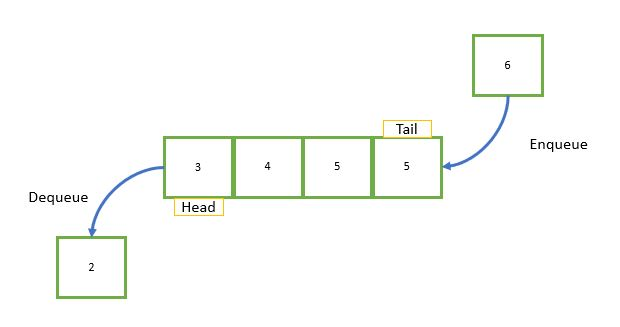
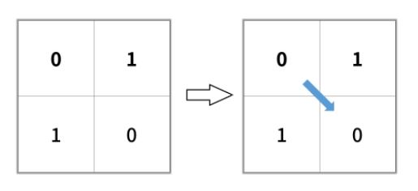
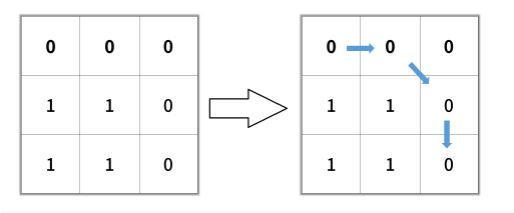
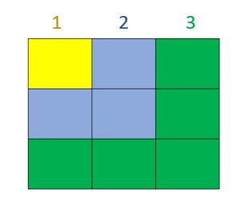
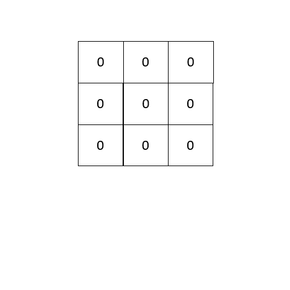
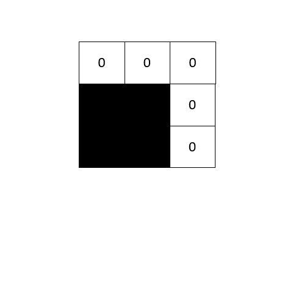

# Queue: First-in-first-out (FiFo)

A queue is a data structure in which the elements inserted go out in the same order they were inserted. The first element going in, will be the first element going out.

In queues we don't focus in getting each element separately when needed. Instead, we add multiple elements and the only way we have the access the last one we inserted is getting all other elements in the queue.

The insert operation in a queue is also called `enqueue`, the delete operation is also called `dequeue`:



In the image above we insert in the tail of a list and delete from the head of that list.

## How to use it on python
We could implement an queue by simply using a dynamic array. To `enqueue` we just need to append a new element to the array. To `dequeue` we just need to delete the first element from the array.

However, the problem with a dynamic array is that we would need to re-index the entire array when we dequeue (Which is *O(n)*). That is why in python a queue is implemented with a linked list, the advantage of a linked list lies on its performance to delete and add elements to its tail and head all those operation are *O(1)* performance using a linked list.

The easier way to use a queue in python is just use on of its in-built libraries. We can use Queue
```python
from queue import Queue
q = Queue()
```

or we can use the collection.deque class (deque is another data structure out of the scope of this tutorial)

```python
from collection import deque
q = deque()
```
`q.append()` would add a new element to the queue and `q.popleft()` would get an element from the queue. In this tutorial we will use the collections library to implement a queue.

# Solving a problem with queue
Lets solve this leetcode problem: [Shortest path binary matrix](https://leetcode.com/problems/shortest-path-in-binary-matrix/).

The problem says that we are given an `n x m` binary matrix grid, we should return the length of the shortest clear path in the matrix. If there is no clear path we should return -1.

> A __clear path__ in a binary matrix is a path from the __top-left__ cell (i.e., (0, 0)) to the __bottom-right__ cell (i.e., (n - 1, n - 1)) such that:
>
>* All the visited cells of the path are 0.
>* All the adjacent cells of the path are __8-directionally__ connected (i.e., they are different and they share an edge or a corner).
>
>The __length of a clear path__ is the number of visited cells of this path.

The problem gives us two examples:

__Example 1:__

>
In this case the output should be __2__

__Example 2:__

>
In this case the output should be __4__

What we should do here is to implement the breath first search algorithm. The algorithm can traverse a grid (or a two dimensional array) by level, in a 3x3 grid this would be the levels:



So, we just need to modify the cells value with the current value of the distance, at the end we just need to return the number in the last cell of the grid (that cell in the bottom right):

Here is a visualization of how it would work:



Now, how would it work if we have obstacles? after all the purpose here is to get the shortest length with all those 1's in the grid.

So, here is a visualization for the __example 2__ note I marked the 1's as black cells:



Well, now what? where is the role of our queue in all this explanation? The answer is: our queue would keep track enqueuing a new level while dequeuing the current level.

So, jump to the code, we would need something to give us all the neighbors for a given cell. So we can create a helper function for this purpose:

```python
def getNeighbors(cell):
    #Directions contain the coordinates for all the possible neighbors
    directions = [(-1,-1),(-1,0),(-1,1),(0,-1),(0,1),(1,-1),(1,0),(1,1)]
    
    for direction in directions:
        #compute neighbors
        newRow = cell[0] + direction[0]
        newCol = cell[1] + direction[1]
        
        #Check index out of bounds
        if newRow < 0 or newRow >= len(grid) or newCol < 0 or newCol >= len(grid[0]):
            continue
        
        #Ignore non 0 cells (we just can go through 0 cells)
        if grid[newRow][newCol] != 0:
            continue
        
        #This is to iterate this function
        yield (newRow,newCol)
```

With the helper function done, we just need to add each visited cell to the queue and change its value to the current distance:
```python
#Create the queue
q = deque()

#Add the first cell
q.append((0,0))

#The first cell will begin our distance count
grid[0][0] = 1

while(len(q) > 0):
    cell= q.popleft() #pop the current cell
    distance = grid[cell[0]][cell[1]] #store the value in the cell
    
    #If we reached the end stop the function and return the distance
    if cell == (len(grid) - 1,len(grid[0]) - 1):
        return distance
    
    for neighbor in getNeighbors(cell):
        #Get the neighbor and change its value by adding one to the current distance
        #Remember we already ignored all invalid cells
        grid[neighbor[0]][neighbor[1]] = distance + 1
        
        #Enqueue the new cell
        q.append(neighbor)

#If we arrive here is because we could not reach the end
return -1
```
__Performance:__ Since, the enqueuing and dequeuing are *O(1)*, and finding neighbor is full of *O(1)* operations, we just worry for the cells we enqueue in dequeue. So the performance is *O(n\*m)* where `n` is the number of rows in the grid and `m` is the number of columns. 

Check the complete solution [here](py/queue.py)


[Next: Tree](3-tree.md)

[Prev: Linked List](1-linkedList.md)


[Back to Welcome Page](0-welcome.md)
