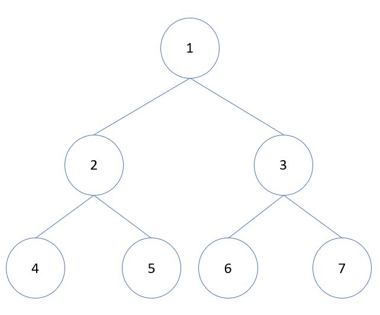
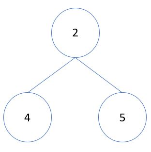
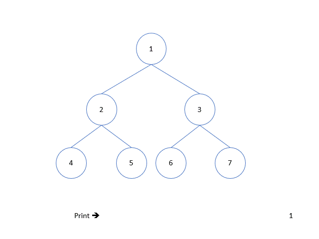
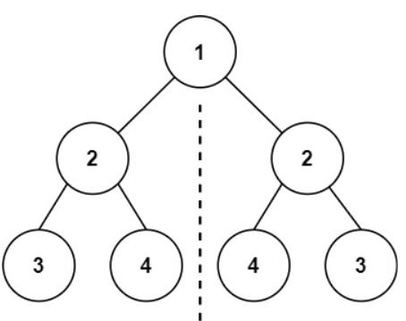
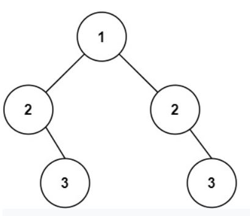
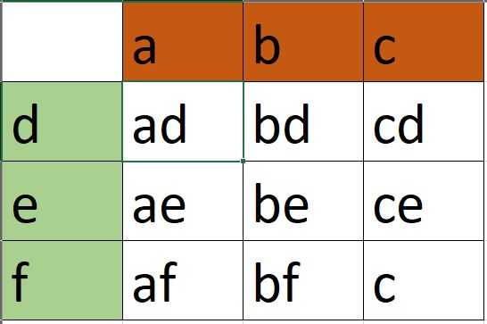
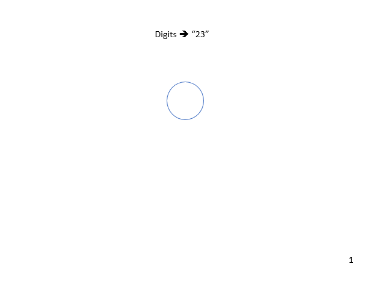

# Tree

A `tree` is a data structure designed to represent herarchical data

A tree is represented by a parent `node` which would link to other nodes. The main node which is used to get all other nodes is called the `root` of the tree. Each node the root link to is called a `child`.

One of the most common `tree` structure is called a `binary tree`. As its name implies, a binary tree us a tree were each node have two or less children. Here is an illustration.



>__Note:__ In this tutorial, the examples will work just with binary trees. At the end we will solve a more complex problem to show an example of a different `tree` structure.

In this example the node which value 1 is the `root` of our tree, its childrean are nodes 2 and 3 which at the same time have their own children. That means we can have a `subtree` taking 2 or 3 as our root:



In this subtree nodes 4 and 5 are at the end of the tree. This nodes are called `leaf nodes`

## How do I "*explore*" a tree?
How can we get all the values in each node of the tree? Since each node is identical, we could potentially use an idential function on each node to get the value. What we do in `trees` is create a single function and then make it call itself. Function that call itself are called *recursive functoins*.

Lets see an exaple. First we would need to design our node:

```python
class TreeNode(object):
    def __init__(self,val = 0):
        self.val = val
        self.left = None
        self.right = None
```

Now that we have a node structure, lets create the our example `tree`
```python
#First level
root = TreeNode(1)
#Second level
root.left = TreeNode(2)
root.right = TreeNode(3)

#Third level
root.left.left = TreeNode(4)
root.left.right = TreeNode(5)

root.right.left = TreeNode(6)
root.right.right = TreeNode(7)
```

Now we can create our *recursive function*. When working with this type of functions we should __always__ have a `base case`. A base case is the instruction that will stop the iteration. With no base case our recursive function will fall in an infinite loop.

We just want to the data, so the we will stop the `recursive calls` when we don't have node availble (node is null):

```python
def printTree(root):
    if root is None:
        return
    print(root.val)
    printTree(root.left)
    printTree(root.right)
```

>To test `printTree` just call it and using the tree created before as a parameter.
>```
>printTree(root)
>```

Now, the result is not perfectly ordered:
```
1
2
4
5
3
6
7
```
>### Quick overview of a stack
>This algorithm is the base for `depth first search` algorithm. The informaiton about this algorithm in [wikipedia](hhttps://en.wikipedia.org/wiki/Depth-first_search) says we need to use a `stack`. Indeed, we are using a hidden stack here. Which is a section of the memory where each recursion call is stored and then poped when a function ends. This is a long topic out of the scope of this tutorial. If you are curious check [this](https://www.geeksforgeeks.org/memory-layout-of-c-program/) out.

Continuing with our output the result is just a way we have to `traverse` the tree and the example above is called `preorder traversal`. It is simple to understand, we are just printing all the elements at the root then left of the tree and then the elements at the right, here in illustration:



We can give priority to the left side (before the root), this is called `inorder traversal`.

```python
def inorderTraversal(root):
    if root is None:
        return
    
    inorderTraversal(root.left)
    print(root.val)
    inorderTraversal(root.right)
```
Here is an illustration:


What if we want to begin from the leaft at the very left? This is called `Postorder traversal` the definition for postorder traversal is get the subtree at the left before, the subtree at the right and finally visit the root.

Take a look:


how would you solve it? when you get a silution you can check [here](py/tree-traversal.py) all the traversal solution discused in this tutorial.

In all the traversal methods we have not seen a result that actually returns the order in which we created the nodes (expected result like: `1,2,3,4,5,6,7`). This is possible but we don't use recursion, instead we use `levelorder traversal` or breadth first search as we did in the queue example.

This function would return `1,2,3,4,5,6,7`:

```python
from collections import deque
def levelorderTraversal(root):
    q = deque()

    q.append(root)

    while(len(q) > 0):
        node =  q.popleft()
        print(node.val)

        if node.left is not None:
            q.append(node.left)
        if node.right is not None:
            q.append(node.right)
```
Note that there is not need of recursion.

__Time and Space complexity__ all the traversal funcitions discused here are *O(n)* where n is the number of nodes in the tree. However in order to traverse the tree we would need to store the entire tree somewhere else (wether the stack or a queue). Thus the space complexity would be *O(n)*.

## Solving problems
Lets solve this [leetocde](https://leetcode.com/problemset/all/) problem:

[101. Symmetric Tree](https://leetcode.com/problems/symmetric-tree/)
The problem states that we need to find if the left node is a mirror to the right. Here is their example:



See? The left subtree is identical to the tree at the right, the only difference is that they are oposite direction.

Leetcode also give us an example of what is NOT a symetric tree:



Even when both subtrees are identical here, they are not simtryc since they don't have the numbers sorted in oposite direction as the first example.

Well, this is the solution.

1. Traverse the left subtree inorder traversal and store the nodes in an list
2. Traversi the right subtree inorder traversal (but from the right node) and store the result in a list
3. If both resulting list are equal, return true, else return false

To traberse the left tree we just need the in order traversal learned in this tutorial:

```python
def leftTraversal(node, res = []):
    if node is None:
        # This is to add nulls into the array
        res.append('x')
        return res
    res.append(node.val)
    leftTraversal(node.left,res)
    leftTraversal(node.right,res)
    
    return res
```

Now the same but backwards:

```python
def rightTraversal(node, res = []):
    if node is None:
        # This is to add nulls into the array
        res.append('x')
        return res
    
    res.append(node.val)
    rightTraversal(node.right,res)
    rightTraversal(node.left,res)
    
    return res
```

We just need to call thos functoins, store the result in two lists and compare the lists to return our value. [Here](py/tree-symetric.py) is the complete solution for this problem.

Now, is time to go for something more complex. Each time we need to use recursion, we can have an sptract tree contructed. When we have a problem that can be divided in subproblems we can surely use recursion to solve it.

Lets solve this problem. [17. Letter Combinations of a Phone Number](https://leetcode.com/problems/letter-combinations-of-a-phone-number/)

>Here I will just give an explaination of the problem, and I will explain the algorithm to be implementd.

This is the problem:

> Given a string containing digits from 2-9 inclusive, return all possible letter combinations that the number could represent. Return the answer in any order.

This is based on the old way cellphone had to write messages:


So, this are the examples:

>__Input:__ digits = "23"
>
>__Output:__ ["ad","ae","af","bd","be","bf","cd","ce","cf"]

>__Input:__ digits = "2"
>
>__Output:__ ["a","b","c"]

In class we learned about the maze problem, we needed to find the path from the top left corner to the botton right corner. For this porpuse we needed to use a backtracking algorithm. The easy explaination for backtracking is: check if a path works and if it does not, backtrack and try another path.

Wikipedia can give us a complete explaination for [backtracking](https://en.wikipedia.org/wiki/Backtracking)

in this problem, each result is a *posible path* between one cell (in this case the digit) and the next one, in the firt example we have 9 possible results. We can visualize it this way:



and we can create a path from each letter on a digit to all of the letters in the next digit:



OK, begin the code, we will need a way to identify the letters on each digit. Lets create a map for that (it can be a dictionary or a simple object as in this example):

```python
letters = {
    '2': 'abc',
    '3': 'def',
    '4': 'ghi',
    '5': 'jkl',
    '6': 'mno',
    '7': 'pqrs',
    '8': 'tuv',
    '9': 'wxyz',
}
```

next we will need to create our backtracking functoin:

```python
res = [] #we need a place to store the result
def backtrack(index,path):
    #The path is as big as the number of digits in the input
    if len(path) == len(digits):
        res.append("".join(path)) # we need to join since path is a list
        return
    
    digit_letters = letters[digits[index]] #Get the letter list from the current digit
    
    for letter in digit_letters: # iterate thorugh the letter list
        path.append(letter) #try the current letter
        backtrack(index + 1, path) #increment the index to go to the next digit
        path.pop() #backtrack
```

Our program is done, we just need to call out backtcking function and return the result:

```python
    backtrack(0,[])
    return res
```
[Here](py/tree-phone.py) is the complete solution.

# Challenges

* [113. Path Sum II](https://leetcode.com/problems/path-sum-ii/) (Tree)
* [39. Combination Sum](https://leetcode.com/problems/combination-sum/) (Recursion)


[Back to Welcome Page](0-welcome.md)
